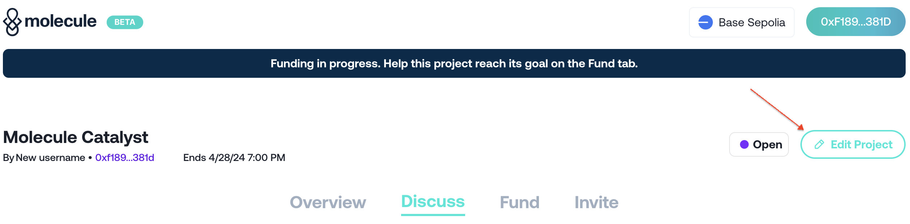

# ▶️ Submit a project proposal

### How do I create a research funding proposal?


Submitting a project proposal on Catalyst


#### Step 1: Click the _**Launch Project**_** button**

Begin by clicking the 'Launch Project' button on the Catalyst homepage. This action initiates the process of creating your new project.

#### Step 2: Upload project files & input your project details

Upload all relevant [project files](https://docs.molecule.to/documentation/catalyst/how-to-get-funding/prepare-project-files-and-materials) that outline your research proposal. Input key details about your project, such as:

* Project Title
* Short Description (500 characters)
* Fundraising Goal: The amount of funding to be raised for the project's first milestone
* Fundraising Deadline

These details provide potential funders with the necessary information to assess the viability and importance of your research.

#### Step 3: Launch your project page

Once your files are uploaded and details entered, launch your project page. This page will serve as the main interface for funders to learn about, discuss, and contribute to your project. Finalizing this process will require several signatures.

#### Step 4: Add remaining project details (optional)

After launching your project page, you can choose to add additional information that might help in attracting more funders or providing clearer insights into your research goals. This step is optional but can enhance the attractiveness of your proposal. To add this information, click the 'Edit Project' button.

<figure><figcaption></figcaption></figure>
