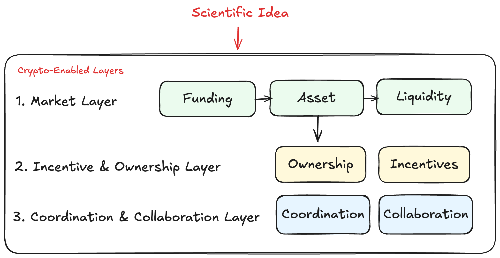

# FAQs

### Why do you need Decentralized Science?

<figure><figcaption></figcaption></figure>

#### 1. Enabling Novel Funding Models + New Asset Class

_**Funding:**_ Traditional grant systems are slow, competitive, and risk-averse. Programmable, decentralized funding mechanisms enable research to be supported earlier and more directly, without reliance on traditional bureaucratic processes. Crypto also enable for novel funding models not possible in traditional finance, such as quadratic funding, retroactive public goods funding, and continuous funding streams that allocate capital dynamically over time.

#### 2. Asset Ownership Across the Scientific Discovery Lifecycle

_**Asset Class:**_ Scientific discovery has historically been illiquid and inaccessible until late-stage commercialization, with value locked in private markets and ownership limited to a small set of investors. Crypto enables scientific outputs and early IP to function as a new asset class by making them representable, fundable, and fractionalizable across the discovery lifecycle. This allows broader participation and economic exposure to scientific progress at multiple stages—from early ideas and validation through development—rather than only at company formation or IPO.

#### 3. Liquidity and Price Discovery for Scientific Assets

**Liquidity:** In traditional research systems, scientific ideas and early discoveries are treated as R\&D expenses and remain illiquid within organizations, with no clear market-based valuation. Crypto enables these research outputs to become programmable assets that can be transferred and traded in open markets. This introduces secondary liquidity and price discovery, allowing scientific value to be surfaced earlier and giving contributors direct control over the assets they help create.

#### 4. Programmable and Transparent Scientific Outputs

_**Modular & Verifiable Provenance:**_ Scientific ideas and research outputs are often fragmented across institutions, poorly attributed, and difficult to track or reuse, leading to duplication and inefficient replication of work. Crypto enables these outputs to be represented digitally with verifiable provenance and programmable ownership, allowing contributions, peer review records, licensing terms, and value flows to be transparently recorded across platforms, improving attribution, reuse, and coordination across the scientific ecosystem.

#### 5. Incentives Aligned with Scientific Contribution and Outcomes

_**Incentives:**_ Crypto enables incentive structures that reward scientific contributions beyond publication, including data, validation, and experimental work. By allowing contributors to participate in the outcomes of the assets they help create, it aligns incentives toward openness, reproducibility, and cumulative progress rather than isolated or hoarded results.

#### 6. Supporting global, permissionless collaboration

_**Collaboration:**_ Scientific collaboration is frequently constrained by institutional affiliation, geography, and access to funding networks. Crypto provides a neutral coordination layer that allows individuals and groups to collaborate without centralized intermediaries. Participation is based on contribution rather than credentials, enabling researchers, funders, and contributors worldwide to coordinate resources, govern projects, and work together across organizational boundaries.

#### 7. Integration with AI Agents and Cloud Laboratories

_**AI doing Science 24/7:**_ In traditional research environments, integrating AI-driven discovery with automated experimentation is difficult due to fragmented systems, manual procurement, slow contracting, and the lack of a standardized way for software agents to trigger and pay for experiments.&#x20;

Crypto provides a programmable coordination layer that allows AI agents to autonomously fund, trigger, and pay for experiments via onchain execution and APIs, while results are transparently recorded and attributed. This enables closed-loop discovery workflows in which hypothesis generation, experimentation, and data ingestion can operate continuously across systems.

